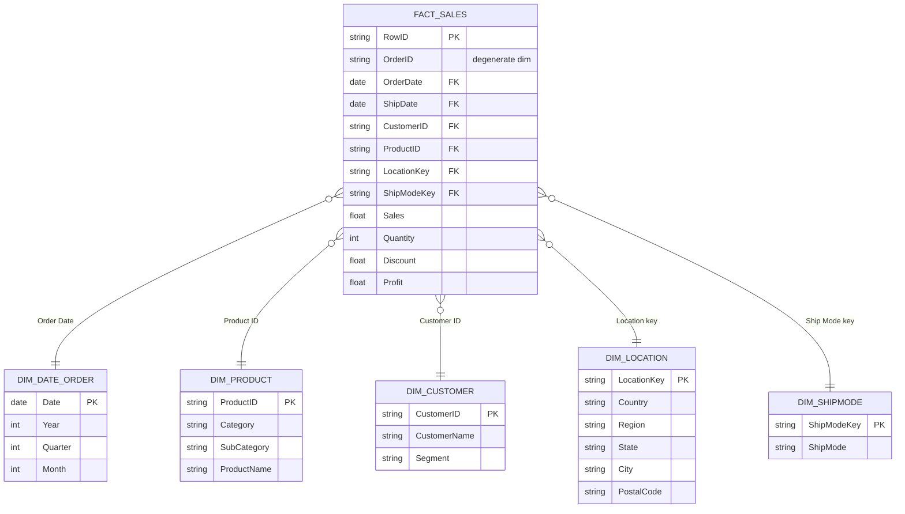

# Data Model — Star Schema

```mermaid
erDiagram
    FACT_SALES }o--|| DIM_DATE_ORDER : "Order Date"
    FACT_SALES }o--|| DIM_PRODUCT : "Product ID"
    FACT_SALES }o--|| DIM_CUSTOMER : "Customer ID"
    FACT_SALES }o--|| DIM_LOCATION : "Location key"
    FACT_SALES }o--|| DIM_SHIPMODE : "Ship Mode key"

    FACT_SALES {
        string RowID PK
        string OrderID "degenerate dim"
        date   OrderDate FK
        date   ShipDate FK
        string CustomerID FK
        string ProductID FK
        string LocationKey FK
        string ShipModeKey FK
        float  Sales
        int    Quantity
        float  Discount
        float  Profit
    }
    DIM_DATE_ORDER {
        date   Date PK
        int    Year
        int    Quarter
        int    Month
    }
    DIM_PRODUCT {
        string ProductID PK
        string Category
        string SubCategory
        string ProductName
    }
    DIM_CUSTOMER {
        string CustomerID PK
        string CustomerName
        string Segment
    }
    DIM_LOCATION {
        string LocationKey PK
        string Country
        string Region
        string State
        string City
        string PostalCode
    }
    DIM_SHIPMODE {
        string ShipModeKey PK
        string ShipMode
    }
```
